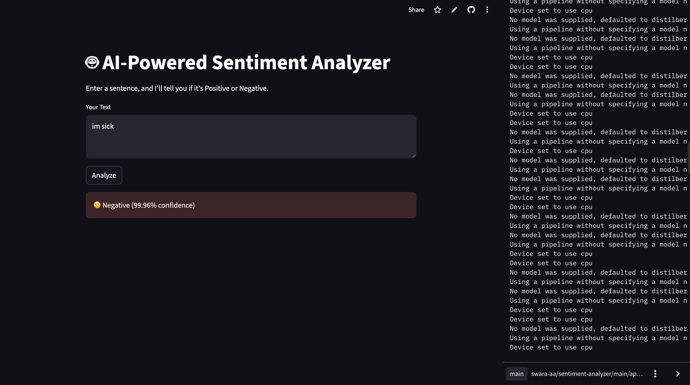

# 🤖 AI-Powered Sentiment Analyzer

This is a simple AI app that classifies the sentiment of any sentence as **Positive** or **Negative** using a pre-trained transformer model.




### 🚀 Live App
[Click here to try it!](https://sentiment-analyzer-48gvjbxk75ntbnmx5gzdd8.streamlit.app/)

---

## 🧠 Tech Stack
- **Python**
- **Streamlit** – for the web UI
- **HuggingFace Transformers** – for sentiment analysis
- **Torch** – for model backend

---

## ✨ Features
- Real-time sentiment classification
- Uses a state-of-the-art DistilBERT model
- Displays confidence score and visual feedback

---

## 📦 How to Run Locally
```bash
pip install streamlit transformers torch
streamlit run app.py
